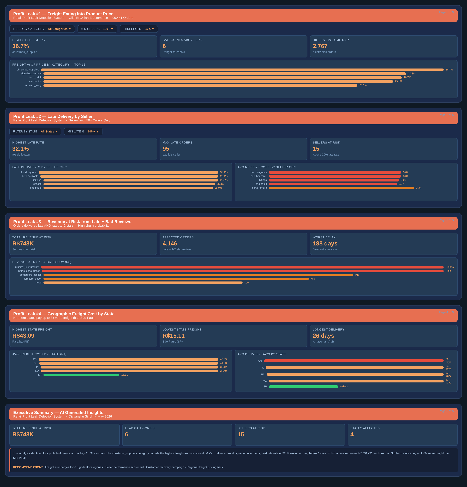

# 🔍 Retail Profit Leak Detection BI System

> Finding hidden revenue losses across 99,441 real orders in Brazilian e-commerce using PostgreSQL, Python, and Power BI.

---

## 📌 What This Project Does

This project answers one real business question:

**"Where is this retail company losing money — and how much?"**

I built a complete analytics pipeline on the Olist Brazilian E-commerce dataset from Kaggle. The pipeline loads raw data into PostgreSQL, validates data quality automatically, runs 4 SQL profit leak analyses, and presents all findings in a 5-page Power BI dashboard with an executive summary.

---

## 🚨 4 Profit Leaks Found

| # | Area | Finding | Impact |
|---|------|---------|--------|
| 1 | Freight vs Price | christmas_supplies loses 36.7% of revenue to shipping | 6 categories above 25% danger threshold |
| 2 | Late Deliveries | foz do iguacu sellers have 32.1% late rate | Every late seller scores below 4.0 stars |
| 3 | Revenue at Risk | 4,146 orders — late AND got bad reviews | R$748,731 at serious churn risk |
| 4 | Geographic Freight | PB pays R$43 vs SP R$15 per order | Northern states pay 3x more than Sao Paulo |

---

## 🛠️ Tools Used

| Tool | Purpose |
|------|---------|
| Python + Pandas | ETL pipeline — load 9 CSV files into PostgreSQL |
| PostgreSQL | Central data warehouse |
| Great Expectations | Automated data quality validation — 8 checks |
| SQL | 4 profit leak queries using JOINs, CASE WHEN, DATE functions |
| Power BI | 5-page interactive dashboard |
| Gemini API | AI-generated executive summary |

---

## 📁 Project Structure
